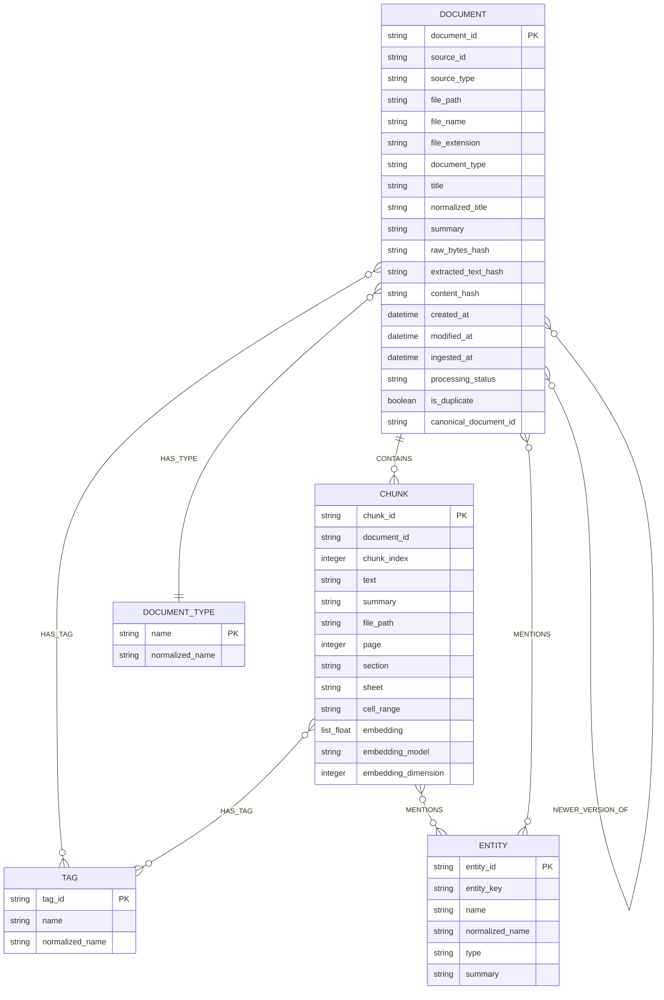

# Graph Schema

## Purpose

This file is the entry point for the Neo4j graph schema for the `personal_kb` MVP.

It explains the graph purpose, MVP shape, design principles, naming conventions, and the focused files that own detailed Neo4j contracts.

## When to read this

Read this file when changing graph architecture, graph boundaries, MVP labels and relationship types, naming conventions, or deciding which focused Neo4j schema file to open.

For exact node properties, relationship properties, constraints, indexes, setup, sync, upserts, retrieval Cypher, future extensions, or verification queries, open the focused files listed below instead of scanning every architecture file.

## Related files

- [neo4j-node-schemas.md](neo4j-node-schemas.md)
- [neo4j-relationship-schemas.md](neo4j-relationship-schemas.md)
- [neo4j-indexes.md](neo4j-indexes.md)
- [neo4j-setup-sync.md](neo4j-setup-sync.md)
- [neo4j-upsert-patterns.md](neo4j-upsert-patterns.md)
- [neo4j-retrieval-queries.md](neo4j-retrieval-queries.md)
- [neo4j-future-extensions.md](neo4j-future-extensions.md)
- [neo4j-validation-risks.md](neo4j-validation-risks.md)
- [storage-design.md](storage-design.md)
- [retrieval-design.md](retrieval-design.md)
- [qa-design.md](qa-design.md)
- [agent-design.md](agent-design.md)

## Source of truth

This file is authoritative for the high-level Neo4j graph schema purpose, MVP graph labels, MVP relationship types, schema diagram, naming conventions, graph design principles, and graph component boundaries.

Focused source-of-truth files:

| Topic | Source of truth |
|---|---|
| Node properties | [neo4j-node-schemas.md](neo4j-node-schemas.md) |
| Relationship properties and deterministic relationship rules | [neo4j-relationship-schemas.md](neo4j-relationship-schemas.md) |
| Constraints, standard indexes, full-text indexes, vector index | [neo4j-indexes.md](neo4j-indexes.md) |
| Database setup, fallback, no-APOC policy, graph sync boundaries | [neo4j-setup-sync.md](neo4j-setup-sync.md) |
| Idempotent Cypher upsert templates | [neo4j-upsert-patterns.md](neo4j-upsert-patterns.md) |
| Neo4j retrieval query templates and graph-backed scoring fields | [neo4j-retrieval-queries.md](neo4j-retrieval-queries.md) |
| Future graph labels and relationships | [neo4j-future-extensions.md](neo4j-future-extensions.md) |
| Verification queries, MVP acceptance criteria, schema risks | [neo4j-validation-risks.md](neo4j-validation-risks.md) |

## Content

### Status

**Status:** Draft v0.1

**Project:** `personal_kb`

**Database target:** `knowledge_base3` with fallback to `neo4j`

**Neo4j setup mode:** explicit `kb setup-db`, optional `--auto-setup-db`

**APOC:** not required, avoided in MVP

**Embedding dimension:** `1024`

**Vector similarity:** `cosine`

**Primary processed storage:** `kb_storage/manifest.json` + `kb_storage/documents/<document_id>.json`

### Responsibility

The Neo4j schema supports:

1. Local document organization.
2. Graph-based document discovery.
3. Hybrid retrieval over:
   - graph relationships;
   - tags;
   - entities;
   - keyword/full-text search;
   - vector similarity over chunks.
4. Source-grounded Q&A.
5. Duplicate and version tracking.
6. Future extension to FAQ/QA memory, Jira, Confluence, Gmail, and Google Drive sources.

The graph is not the only source of processed truth. The rebuildable processed source of truth is:

```text
kb_storage/
  manifest.json
  documents/
    <document_id>.json
```

Neo4j is the operational query layer:

```text
processed JSON
-> GraphSyncService
-> Neo4j graph + vector index
-> RetrievalService / QAService / GraphService
-> LangChain StructuredTools
-> LangGraph personal_kb agent
```

### Component boundaries

Graph schema and sync must not:

- parse files;
- call LLMs;
- generate embeddings;
- decide chunking;
- mutate source documents;
- require APOC in MVP;
- expose graph rebuild or ingestion as agent tools;
- make LLM-inferred document relationships part of the MVP pipeline.

Graph sync transforms processed JSON into graph state. Storage contracts are defined in [storage-design.md](storage-design.md), retrieval behavior is defined in [retrieval-design.md](retrieval-design.md), and graph sync details are defined in [neo4j-setup-sync.md](neo4j-setup-sync.md).

### Design decisions

MVP principles:

1. Keep the graph simple.
2. Avoid APOC.
3. Use deterministic relationships first.
4. Store summaries as node properties, not `Summary` nodes.
5. Store section/page/sheet/range inside `Chunk.source_ref` properties, not as `Section` nodes.
6. Store embeddings on `Chunk` nodes and also in processed JSON.
7. Use strict IDs from Pydantic schemas.
8. Use idempotent Cypher upserts.
9. Do not expose graph rebuild or ingestion as agent tools.
10. Keep future extension points visible but not implemented in MVP.

### Trade-offs

The MVP goal is not to build a perfect ontology. The goal is to get a reliable loop:

```text
local files
-> processed JSON
-> Neo4j graph
-> hybrid retrieval
-> source-grounded answers
-> benchmark validation
```

A more complex ontology can be added after retrieval quality is measured.

### MVP graph labels

```text
(:Document)
(:Chunk)
(:Entity)
(:Tag)
(:DocumentType)
```

### MVP relationship types

```text
(:Document)-[:CONTAINS]->(:Chunk)
(:Document)-[:HAS_TAG]->(:Tag)
(:Chunk)-[:HAS_TAG]->(:Tag)
(:Document)-[:HAS_TYPE]->(:DocumentType)
(:Chunk)-[:MENTIONS]->(:Entity)
(:Document)-[:MENTIONS]->(:Entity)
(:Document)-[:DUPLICATE_OF]->(:Document)
(:Document)-[:NEWER_VERSION_OF]->(:Document)
(:Document)-[:RELATED_TO]->(:Document)
```

### Mermaid schema diagram



### Naming conventions

Labels use PascalCase:

```text
Document
Chunk
Entity
Tag
DocumentType
```

Future labels also use PascalCase:

```text
Question
Answer
FAQEntry
SearchQuery
UserFeedback
Source
JiraIssue
ConfluencePage
GmailThread
GoogleDoc
GoogleSheet
GoogleSlide
```

Relationship types use uppercase snake case:

```text
CONTAINS
HAS_TAG
HAS_TYPE
MENTIONS
DUPLICATE_OF
NEWER_VERSION_OF
RELATED_TO
```

Property names use lowercase snake case:

```text
document_id
source_id
file_path
normalized_name
raw_bytes_hash
extracted_text_hash
```

For MVP, tag/entity normalization is:

```text
lowercase
trim
collapse repeated spaces
```

Example:

```text
"  Annual   Budget  " -> "annual budget"
```

LLM-based canonicalization is future work.

### Final MVP recommendation

Use this MVP schema:

```text
Document
Chunk
Tag
Entity
DocumentType
```

with relationships:

```text
CONTAINS
HAS_TAG
HAS_TYPE
MENTIONS
DUPLICATE_OF
NEWER_VERSION_OF
RELATED_TO
```

Do not add `Section`, `Summary`, `Question`, `Answer`, `FAQEntry`, `Source`, or external source nodes in MVP.

Do not use APOC.

Do not rely on LLM-inferred relationships yet.

The next implementation step should be:

```text
Pydantic schemas
-> config
-> manifest storage
-> kb setup-db
-> GraphSyncService upsert methods
```

## Dependencies

- `kb_storage/manifest.json`
- `kb_storage/documents/<document_id>.json`
- [storage-design.md](storage-design.md)
- [model-strategy.md](model-strategy.md)
- [retrieval-design.md](retrieval-design.md)
- [qa-design.md](qa-design.md)
- [agent-design.md](agent-design.md)
- Neo4j database `knowledge_base3`, with fallback to `neo4j`
- Embeddings with dimension `1024`

## Failure modes / risks

See [neo4j-validation-risks.md](neo4j-validation-risks.md) for schema risks and mitigations.

High-level graph risks:

- schema complexity can slow MVP delivery;
- inconsistent tag/entity normalization weakens retrieval;
- relationship duplication can create noisy graph traversal;
- storing query-specific scores in Neo4j can make stale score data look authoritative.

## Validation

Validate this entry-point file by checking that:

- every MVP label listed here has its properties defined in [neo4j-node-schemas.md](neo4j-node-schemas.md);
- every MVP relationship listed here has its properties defined in [neo4j-relationship-schemas.md](neo4j-relationship-schemas.md);
- every setup/index claim links to [neo4j-indexes.md](neo4j-indexes.md) or [neo4j-setup-sync.md](neo4j-setup-sync.md);
- no MVP-only section adds `Section`, `Summary`, FAQ memory nodes, source-specific nodes, or LLM-inferred relationships as required graph entities.

## Update rules

Update this file when the high-level Neo4j schema shape, naming conventions, graph boundaries, MVP labels, MVP relationship types, or graph design principles change.

Update the focused Neo4j files when changing exact properties, Cypher, setup behavior, query templates, future extensions, or validation checks.
