# Architecture Overview

## Purpose

This file defines the system-wide technical architecture for `personal_kb`.

## When to read this

Read this file when changing global architecture decisions, MVP scope, non-goals, configuration defaults, validation gates, security posture, risk handling, build order, or unresolved architecture questions.

## Related files

- [storage-design.md](storage-design.md)
- [graph-schema.md](graph-schema.md)
- [model-strategy.md](model-strategy.md)
- [retrieval-design.md](retrieval-design.md)
- [qa-design.md](qa-design.md)
- [agent-design.md](agent-design.md)
- [../product-requirements/index.md](../product-requirements/index.md)

## Source of truth

This file is authoritative for the high-level system architecture, global decisions, assumptions, MVP non-goals, configuration shape, validation plan, security posture, system risks, recommended build order, open questions, and final architecture recommendation.

## Content

### Status and primary goal

**Status:** Draft v0.3

**Package name:** `personal_kb`

**Primary goal:** build a local-first document organization and retrieval system that ingests personal/work documents, constructs a Neo4j knowledge graph, supports hybrid GraphRAG search, and exposes agent-friendly search/Q&A tools through an internal LangGraph + LangChain StructuredTool agent layer.

### Executive summary

`personal_kb` is a local-first knowledge base and GraphRAG engine for organizing documents from multiple sources.

The MVP focuses on local files:

- PDF
- DOCX
- Markdown
- TXT
- XLSX

Future sources:

- Confluence pages
- Jira issues
- Gmail threads
- Google Docs
- Google Sheets
- Google Slides
- external links
- manual uploads

The system has two main flows:

1. Deterministic ingestion pipeline
   - Reads files from `data/`.
   - Parses and normalizes content.
   - Computes both raw-bytes hash and extracted-text hash.
   - Chunks documents using format-aware chunking.
   - Generates summaries, tags, entities, and embeddings.
   - Stores processed output in `kb_storage/` as primary rebuildable JSON state.
   - Syncs graph structure and vectors into Neo4j.
2. Agentic retrieval/query layer
   - MVP uses LangGraph as the internal agent orchestration layer.
   - Personal KB capabilities are exposed to the agent as LangChain `StructuredTool` objects.
   - LangChain `StructuredTool` wrappers call `KnowledgeToolService`.
   - `KnowledgeToolService` delegates to core Python services such as `RetrievalService`, `QAService`, and `GraphService`.
   - Agent does not ingest documents.
   - Agent uses search/Q&A tools only.
   - Agent can search by graph, tags, entities, keywords, vector similarity, or hybrid strategy.
   - Output is structured JSON for tool usage.
   - MCP is not the primary internal path in MVP; it becomes a later adapter exposing the same core tools to external clients.

The MVP intentionally avoids destructive actions:

- no file moving
- no file renaming
- no file deletion
- no write operations to original sources
- no automatic updates to Confluence/Jira/Gmail yet
- no APOC dependency

### Core architectural decisions

| Area | Decision |
|---|---|
| Project package | `personal_kb` |
| Python version | `3.11` |
| Package manager | `uv` |
| CLI framework | `argparse` |
| Main architecture | deterministic ingestion + agentic search |
| MVP source folder | `data/` |
| Processed storage folder | `kb_storage/` |
| Benchmark folder | `benchmark/` |
| Storage | Neo4j-only for graph/vector + JSON primary processed storage |
| Vector DB | Neo4j vector index in MVP |
| Primary processed storage | manifest + per-document JSON |
| LLM provider | Local LM Studio OpenAI-compatible endpoint |
| LM Studio base URL | `http://localhost:1234/v1` |
| LLM model | `mlx-community/Qwen3.5-9B-OptiQ-4bit` |
| LLM runtime | `mlx-lm` |
| Embedding model | `Qwen/Qwen3-Embedding-0.6B` |
| Embedding dimension | `1024` |
| Reranker model | `Qwen/Qwen3-Reranker-0.6B` |
| Embedding execution | local `transformers` / `sentence-transformers` |
| Reranker execution | local `transformers` / `sentence-transformers` |
| External APIs | not required for MVP |
| Agent access | search/query tools only |
| MVP agent orchestration | LangGraph internal agent |
| MVP tool exposure | LangChain `StructuredTool` wrappers |
| Tool implementation rule | tools call core Python services; no business logic inside tools |
| Internal MVP path | User -> LangGraph `personal_kb` agent -> LangChain `StructuredTools` -> `KnowledgeToolService` -> core services |
| MCP role | future adapter after MVP core tools are stable; not primary internal path |
| Source mutation | not allowed in MVP |
| Source identity | `source_id = relative file_path` |
| Document identity | `document_id = stable UUID` |
| Change detection | `raw_bytes_hash` + `extracted_text_hash` |
| Versioning | auto-create new `Document` linked via `NEWER_VERSION_OF` |
| Duplicate handling | exact duplicate only: own `Document` node + `DUPLICATE_OF` edge |
| Canonical document | newest `modified_at`; fallback `ingested_at` |
| Neo4j deployment | already deployed through Docker Compose / local instance |
| Neo4j URI | `bolt://localhost:7687` |
| Neo4j database | `knowledge_base3`, fallback `neo4j` if needed |
| APOC | avoided in MVP |
| DB setup | primary: `kb setup-db`; optional: `--auto-setup-db` |
| Ingest graph sync | `kb ingest` syncs Neo4j automatically |
| CLI output | readable by default; `--json` for machine-readable output |

### Assumptions

1. The MVP runs locally.
2. The first implementation is optimized for experimentation, not production multi-user usage.
3. Neo4j is available locally through Docker Compose or an already deployed local instance.
4. The preferred configured Neo4j database is `knowledge_base3`.
5. If `knowledge_base3` is unavailable because of Neo4j edition/deployment limits, the system can fall back to `neo4j`.
6. APOC is not required for MVP.
7. LM Studio exposes an OpenAI-compatible local endpoint at `http://localhost:1234/v1`.
8. The LLM is `mlx-community/Qwen3.5-9B-OptiQ-4bit` running with `mlx-lm`.
9. Embedding and reranking models run locally through `transformers` or `sentence-transformers`.
10. Original files are treated as immutable source inputs.
11. JSON processed storage is the primary rebuildable state.
12. Neo4j can be rebuilt from processed JSON without re-running expensive parsing/summarization/entity extraction.
13. Search latency target for MVP is around 10 seconds for document lookup and relationship retrieval.
14. The first implementation target is schemas + config + manifest, before Neo4j schema or full ingestion.
15. MVP agent orchestration uses LangGraph internally.
16. Agent-facing capabilities are exposed as LangChain `StructuredTool` wrappers over core Python services.
17. MCP is not used as the primary internal path in MVP.

### Non-goals for MVP

The MVP does not include:

- real-time sync with Confluence/Jira/Gmail/Google Drive
- permission-aware multi-user access control
- automatic file reorganization
- write actions to external sources
- FAQ/QA memory implementation
- LLM-inferred document relationships as a required pipeline step
- web UI
- Telegram bot
- human approval workflow for external writes
- production-grade observability
- scanned PDF OCR
- APOC dependency
- MCP server as the primary internal agent path

These are future steps.

### High-level architecture

```mermaid
flowchart TD
    User[User] --> CLI[argparse CLI]
    User --> LangGraphAgent[LangGraph personal_kb Agent]

    CLI --> SetupDB[kb setup-db]
    CLI --> IngestionCLI[kb ingest data]
    CLI --> CLISearch[kb search / kb ask]

    LangGraphAgent --> StructuredTools[LangChain StructuredTools]
    CLISearch --> KnowledgeToolService[KnowledgeToolService]
    StructuredTools --> KnowledgeToolService

    subgraph App[personal_kb Python 3.11 Application]
        SetupDB --> SchemaSetup[Neo4j Schema Setup Service]
        IngestionCLI --> IngestionService[Deterministic Ingestion Service]

        IngestionService --> FileDiscovery[File Discovery: data/]
        IngestionService --> HashingService[Hashing: raw bytes + extracted text]
        IngestionService --> ParserLayer[Document Parser Layer]
        IngestionService --> ChunkingService[Chunking Service]
        IngestionService --> ExtractionService[LLM Extraction Service]
        IngestionService --> EmbeddingService[Embedding Service]
        IngestionService --> ProcessedStorage[Processed JSON Storage: kb_storage/]
        IngestionService --> GraphSyncService[Neo4j Graph Sync Service]

        KnowledgeToolService --> RetrievalService[Retrieval Service]
        KnowledgeToolService --> QAService[Q&A Service]
        KnowledgeToolService --> DocumentService[Document Service]
        KnowledgeToolService --> DuplicateService[Duplicate Service]
        KnowledgeToolService --> RelationshipService[Relationship Explanation Service]

        RetrievalService --> QueryUnderstanding[Query Understanding]
        RetrievalService --> GraphSearch[Graph Search]
        RetrievalService --> TagEntitySearch[Tag/Entity Search]
        RetrievalService --> VectorSearch[Vector Search]
        RetrievalService --> RerankerService[Reranker Service]
        QAService --> AnswerService[Answer Generation Service]
    end

    FileDiscovery --> LocalDocs[(Local Documents: data/)]
    ProcessedStorage --> StorageFS[(kb_storage/manifest.json + documents/*.json)]
    GraphSyncService --> Neo4j[(Neo4j Graph + Vector Index
DB: knowledge_base3 / fallback neo4j)]
    SchemaSetup --> Neo4j

    GraphSearch --> Neo4j
    TagEntitySearch --> Neo4j
    VectorSearch --> Neo4j
    DocumentService --> StorageFS
    DuplicateService --> Neo4j
    RelationshipService --> Neo4j

    AnswerService --> LocalLLM[LM Studio: Qwen3.5 9B OptiQ 4bit]
    ExtractionService --> LocalLLM
    EmbeddingService --> LocalEmbedding[Qwen3-Embedding-0.6B
1024 dims]
    RerankerService --> LocalReranker[Qwen3-Reranker-0.6B]

    subgraph FutureMCP[Future MCP Integration - after MVP]
        MCPServer[MCP Server Adapter]
        ExternalAgent[External Agent / Client]
        ExternalSources[External MCP Clients: Confluence/Jira/Gmail/Drive]
    end

    ExternalAgent -.-> MCPServer
    MCPServer -.-> KnowledgeToolService
    ExternalSources -.-> IngestionService
```



The MVP runtime path is:

```text
User
-> LangGraph personal_kb agent
-> LangChain StructuredTools
-> KnowledgeToolService
-> RetrievalService / QAService / GraphService
-> Neo4j + kb_storage + local models
```

MCP is not the primary internal path in MVP. The internal path uses LangGraph and LangChain `StructuredTool` wrappers. MCP will be added after the MVP core tools are stable, and the MCP adapter will expose the same core tool capabilities to external agents/clients.

### Configuration contract

Configuration should be explicit and file-based.

```yaml
project:
  package_name: personal_kb
  python_version: "3.11"
  package_manager: uv
  cli_framework: argparse

paths:
  documents_dir: data
  storage_dir: kb_storage
  benchmark_dir: benchmark
  path_mode: relative

neo4j:
  uri: bolt://localhost:7687
  username: neo4j
  password_env: NEO4J_PASSWORD
  database: knowledge_base3
  fallback_database: neo4j
  apoc_required: false
  schema_setup:
    primary_mode: kb_setup_db
    optional_mode: auto_setup_db
  ingest_auto_sync: true

models:
  llm:
    provider: lmstudio_openai_compatible
    base_url: http://localhost:1234/v1
    model_name: mlx-community/Qwen3.5-9B-OptiQ-4bit
    runtime: mlx-lm
    quantization: mixed_precision_4bit
    role: production_default

  embedding:
    provider: local_transformers_or_sentence_transformers
    model_name: Qwen/Qwen3-Embedding-0.6B
    dimension: 1024
    context_length: 32768
    normalize_embeddings: true
    instruction_aware: true
    store_full_vectors_in_json: true

  reranker:
    provider: local_transformers_or_sentence_transformers
    model_name: Qwen/Qwen3-Reranker-0.6B
    context_length: 32768
    top_k_before_rerank: 50
    top_k_after_rerank: 8
    instruction_aware: true

parsers:
  pdf:
    primary: pdfplumber
    fallback: pymupdf
    scanned_pdf_ocr: false
  docx:
    primary: mammoth
    fallback: python-docx
  md:
    primary: built_in
  txt:
    primary: built_in
  xlsx:
    primary: openpyxl

hashing:
  algorithm: sha256
  raw_bytes_hash: true
  extracted_text_hash: true

versioning:
  changed_file_behavior: auto_NEWER_VERSION_OF

duplicates:
  exact_duplicates_only: true
  behavior: own_document_node_with_DUPLICATE_OF_edge

normalization:
  tag_entity_normalization: lowercase_trim_collapse_spaces
  llm_canonicalization: future

chunking:
  txt:
    chunk_size: 1200
    chunk_overlap: 150
  pdf:
    max_pages_per_chunk: 1
  markdown:
    split_by_headings: true
  docx:
    split_by_headings: true
  xlsx:
    chunk_by: sheet_table_range

search:
  default_top_k: 10
  include_related_documents: true
  include_chunks: true
  score_mode: hybrid_formula_with_reranker
  weights:
    graph_score: 0.25
    vector_score: 0.20
    entity_score: 0.15
    tag_score: 0.10
    title_keyword_score: 0.10
    reranker_score: 0.20

benchmark:
  location: benchmark
  initial_size: 15-20
```

### Observability

MVP logging should be simple but structured.

Future observability includes:

- LangSmith or custom traces
- token/cost estimates even for local models
- latency dashboards
- graph sync audit
- model output validation reports

Component-specific logging requirements are owned by the focused files:

- ingestion logs: [storage-design.md](storage-design.md)
- search logs: [retrieval-design.md](retrieval-design.md)

### Validation plan

The system needs a small benchmark dataset from the beginning.

Benchmark location:

```text
benchmark/
```

Initial size:

```text
15-20 benchmark cases
```

Benchmark format:

```json
{
  "question": "Where is information about accounting budgets?",
  "expected_document_ids": ["doc_123"],
  "expected_answer_contains": ["budget", "accounting"],
  "expected_entities": ["Budget", "Accounting"],
  "expected_source_refs": [
    {
      "file_path": "data/budget_2025.xlsx",
      "sheet": "Budget"
    }
  ]
}
```

System metrics:

- ingestion latency per document
- search latency
- Q&A latency
- graph sync success rate
- failed extraction rate
- invalid JSON rate

MVP is successful if:

1. The system processes local files from `data/` into `kb_storage/` and Neo4j.
2. The system builds graph links between documents, chunks, tags, and entities.
3. Search returns the expected document in top-10 for benchmark questions.
4. Q&A returns source-grounded answers with source references.
5. Document lookup works under approximately 10 seconds on the initial dataset.
6. Neo4j can be rebuilt from processed JSON without reprocessing documents.
7. Failed documents remain visible in manifest with clear errors.
8. `kb setup-db` initializes the graph schema without APOC.

Retrieval-specific metrics are defined in [retrieval-design.md](retrieval-design.md). Q&A-specific metrics are defined in [qa-design.md](qa-design.md).

### Security and privacy

MVP security posture:

- local-first
- no external LLM API required
- original files are not modified
- relative source paths stored locally
- no automatic emails or external writes
- secrets stored through environment variables

Documents may contain:

- personal data
- financial information
- account data
- emails
- project-sensitive information

Mitigations:

- keep local storage private
- avoid logging full document text by default
- log IDs and metadata instead of full content
- store secrets in `.env`, not code
- do not expose write actions in MVP
- add redaction later if needed

Future security work:

- access control
- encryption at rest
- per-source permissions
- audit logs
- user-level visibility filters

### Risks and mitigations

| Risk | Impact | Mitigation |
|---|---|---|
| Overengineering graph too early | slow MVP | use simple graph nodes in v1 |
| Weak extraction quality | bad graph/search | validate on benchmark dataset |
| Bad chunking | poor retrieval | use format-specific chunkers |
| Local model instability | invalid outputs | schema validation + retries |
| Neo4j schema drift | hard rebuilds | JSON is primary processed storage |
| Neo4j database mismatch | setup confusion | use configured `knowledge_base3` with fallback to `neo4j` |
| APOC dependency creep | deployment fragility | avoid APOC in MVP |
| Slow search | bad UX | cache embeddings, top-k limits, reranker only after candidate pruning |
| Duplicate/version confusion | wrong canonical docs | deterministic canonical rule |
| Hallucinated answers | low trust | answer only from supporting chunks |
| Too many agent powers | unsafe behavior | agent has search tools only |
| No evaluation | no way to improve | create JSONL benchmark immediately |

### Future architecture extensions

Future extensions are documented in the focused files that own them:

- multi-source connectors and OCR: [storage-design.md](storage-design.md)
- source-specific graph nodes, FAQ/QA memory graph structure, and LLM-inferred relationships: [graph-schema.md](graph-schema.md)
- future search layers: [retrieval-design.md](retrieval-design.md)
- grounded answer reuse through FAQ memory: [qa-design.md](qa-design.md)
- controlled write actions, future agent tools, future UI options, and MCP integration: [agent-design.md](agent-design.md)

### Recommended MVP build order

Current chosen first implementation target:

```text
schemas + config + manifest
```

Recommended order:

1. Create package `personal_kb`.
2. Configure Python `3.11` with `uv`.
3. Define Pydantic schemas.
4. Implement config loader.
5. Implement path utilities for relative paths.
6. Implement hashing utilities for raw bytes and extracted text.
7. Implement manifest storage.
8. Implement per-document JSON storage.
9. Implement local file discovery for `data/`.
10. Implement parsers for TXT/MD first.
11. Implement parser interfaces for PDF/DOCX/XLSX.
12. Implement `kb setup-db`.
13. Implement Neo4j graph schema setup without APOC.
14. Implement graph sync from processed JSON.
15. Implement local LLM extraction.
16. Implement local embeddings.
17. Save embeddings as full arrays in JSON.
18. Implement keyword/entity/tag search.
19. Implement vector search.
20. Implement hybrid scoring.
21. Add local reranker.
22. Implement `search_documents`.
23. Implement `answer_question`.
24. Implement CLI commands.
25. Add PDF/DOCX/XLSX parsers.
26. Create benchmark JSONL in `benchmark/`.
27. Run retrieval/Q&A evaluation.
28. Iterate chunking and scoring.

### Remaining open questions

Most blocking architecture questions are resolved. Remaining questions can be answered during implementation:

1. Exact Pydantic schema field constraints and enum names.
2. Whether `knowledge_base3` exists in the current Neo4j deployment or fallback to `neo4j` is required.
3. Exact CLI command names and flags for dry-run/debug output.
4. Exact prompt schemas for extraction.
5. Whether embeddings should be compressed in JSON later if storage grows too large.
6. How many documents Neo4j-only vector search can handle before an external vector DB is needed.
7. Whether search cache should be added after the first benchmark run.

### Final recommendation

Build the MVP as:

```text
Local files in data/
-> deterministic ingestion
-> processed JSON in kb_storage/ as source of truth
-> Neo4j graph/vector sync without APOC
-> hybrid retrieval with Qwen3 local reranker
-> agent-facing search/Q&A tools
-> argparse CLI
```

Do not add Confluence/Jira/Gmail or MCP source clients until local ingestion, graph sync, LangChain StructuredTools, LangGraph agent orchestration, and search evaluation are stable.

Do not expose ingestion, setup, or rebuild functions to the agent.

Do not implement FAQ memory in MVP, but preserve graph/schema space for it.

Do not rely on LLM-generated graph relationships. Start with deterministic links from tags, entities, versions, duplicates, and source references.

The first real milestone should be:

```text
Given a local folder with 10-20 documents in data/, the system builds processed JSON + Neo4j graph and correctly finds expected documents for 15-20 benchmark questions with source references.
```

## Dependencies

- Python `3.11`
- `uv`
- `argparse`
- local files in `data/`
- processed storage in `kb_storage/`
- benchmark data in `benchmark/`
- Neo4j at `bolt://localhost:7687`
- configured database `knowledge_base3` with fallback `neo4j`
- LM Studio OpenAI-compatible endpoint at `http://localhost:1234/v1`
- `mlx-community/Qwen3.5-9B-OptiQ-4bit`
- `Qwen/Qwen3-Embedding-0.6B`
- `Qwen/Qwen3-Reranker-0.6B`

## Failure modes / risks

See the risk table in this file for system-wide risks. Component-specific failure modes are defined in the focused architecture files.

## Validation

Validate this architecture by checking that implementation decisions preserve the MVP acceptance criteria, the local-first security posture, the no-APOC constraint, the processed JSON source-of-truth rule, and the agent search-only boundary.

## Update rules

Update this file when a global architecture decision, assumption, non-goal, configuration key, validation gate, security policy, risk, build-order milestone, open question, or final recommendation changes.
