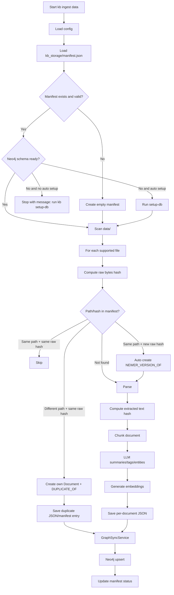

# Storage Design

## Purpose

This file defines the architecture for source documents, parsing, chunking, processed JSON storage, manifests, document identity, versioning, duplicates, ingestion, and file-type-specific processing.

## When to read this

Read this file when changing ingestion, supported file types, parser behavior, chunking, source references, manifest fields, per-document JSON, identity rules, duplicate/version behavior, storage layout, or source connector normalization.

## Related files

- [overview.md](overview.md)
- [graph-schema.md](graph-schema.md)
- [model-strategy.md](model-strategy.md)
- [retrieval-design.md](retrieval-design.md)
- [agent-design.md](agent-design.md)

## Source of truth

This file is authoritative for `data/`, `kb_storage/`, parser output contracts, chunk contracts, processed JSON contracts, manifest behavior, document identity, versioning, duplicate handling, local file ingestion, file-type processing, ingestion logging, and ingestion failure handling.

## Content

### Responsibility

The storage and ingestion layer provides durable rebuildable state for the rest of the system.

It must:

- read original documents from `data/`;
- treat original files as immutable source inputs;
- normalize supported file formats into a common internal document contract;
- compute raw and extracted-text hashes;
- chunk documents with format-aware chunkers;
- store full chunk text for source-grounded Q&A;
- store processed outputs in `kb_storage/` as primary rebuildable state;
- preserve failed-document records in the manifest;
- provide processed JSON that can rebuild Neo4j without re-running expensive parsing, summarization, entity extraction, or embedding generation.

### Component boundaries

Storage and ingestion should not:

- expose source-mutation actions;
- decide query-time retrieval behavior;
- run agent orchestration;
- require APOC;
- write to external sources;
- hide failed documents from the manifest.

Graph sync consumes processed JSON and is documented in [graph-schema.md](graph-schema.md). Model calls used during extraction are documented in [model-strategy.md](model-strategy.md).

### Source layer

The source layer is responsible for providing raw documents.

MVP source:

```text
local_file
```

Supported file extensions:

```text
.pdf
.docx
.md
.txt
.xlsx
```

Default source folder:

```text
data/
```

Future sources:

```text
confluence_page
jira_issue
gmail_thread
google_doc
google_sheet
google_slide
external_url
manual_upload
```

Future sources should be normalized into the same internal `RawDocument` contract.

### Parsing and normalization layer

The parsing and normalization layer converts different file formats into normalized document content.

Parser stack:

| File type | Primary parser | Fallback | MVP notes |
|---|---|---|---|
| PDF | `pdfplumber` | `PyMuPDF` | OCR disabled |
| DOCX | `mammoth` | `python-docx` | `mammoth` for semantic HTML/text, `python-docx` for raw paragraphs/tables fallback |
| Markdown | built-in parser | none | preserve heading hierarchy |
| TXT | built-in parser | none | normalize whitespace |
| XLSX | `openpyxl` | none | workbook/sheet/range extraction |

Parser output contract:

```json
{
  "source_id": "data/file.pdf",
  "source_type": "local_file",
  "file_path": "data/file.pdf",
  "file_name": "file.pdf",
  "file_extension": "pdf",
  "title": "file",
  "raw_text": "...",
  "metadata": {
    "created_at": "...",
    "modified_at": "...",
    "size_bytes": 123456
  },
  "hashes": {
    "raw_bytes_hash": "sha256...",
    "extracted_text_hash": "sha256..."
  }
}
```

All paths stored in JSON are relative to the project root.

### Chunking layer

The chunking layer converts normalized document content into chunks.

| File type | Chunking strategy |
|---|---|
| PDF | page-aware chunks |
| DOCX | heading-aware chunks |
| Markdown | heading-aware chunks |
| TXT | fixed-size chunks |
| XLSX | sheet/table/range chunks |

Chunk contract:

```json
{
  "chunk_id": "uuid",
  "document_id": "uuid",
  "chunk_index": 0,
  "text": "...",
  "summary": "...",
  "tags": [],
  "entities": [],
  "source_ref": {
    "file_path": "data/budget.xlsx",
    "page": null,
    "section": null,
    "sheet": "Budget",
    "cell_range": "A1:F40"
  },
  "embedding": [0.01, 0.02],
  "embedding_model": "Qwen/Qwen3-Embedding-0.6B",
  "embedding_dimension": 1024
}
```

Full chunk text is stored because Q&A needs source-grounded context.

### Processed JSON storage layer

JSON is the primary processed storage, not just a cache.

Neo4j can be rebuilt from JSON without reprocessing documents through LLM calls.

Storage layout:

```text
kb_storage/
  manifest.json
  documents/
    <document_id>.json
  logs/
    ingestion.log
    search.log
```

Raw extracted text is stored inside the per-document JSON, mainly for debugging and future re-chunking. It is not necessary to store a separate `raw_text/<id>.txt` file in MVP.

Manifest structure:

```json
{
  "schema_version": "0.2",
  "active_neo4j_database": "knowledge_base3",
  "fallback_neo4j_database": "neo4j",
  "documents": [
    {
      "document_id": "uuid",
      "source_id": "data/budget_2025.xlsx",
      "file_path": "data/budget_2025.xlsx",
      "file_name": "budget_2025.xlsx",
      "file_extension": "xlsx",
      "raw_bytes_hash": "sha256...",
      "extracted_text_hash": "sha256...",
      "processed_json_path": "kb_storage/documents/uuid.json",
      "status": "processed",
      "error_message": null,
      "ingested_at": "2026-05-09T12:00:00",
      "modified_at": "2026-05-08T18:20:00",
      "neo4j_synced": true,
      "canonical_document_id": "uuid",
      "duplicate_of": null,
      "newer_version_of": null
    },
    {
      "document_id": "uuid-failed",
      "source_id": "data/broken.pdf",
      "file_path": "data/broken.pdf",
      "status": "failed",
      "error_message": "Parser failed: ...",
      "neo4j_synced": false
    }
  ]
}
```

Failed documents stay in manifest with `status = "failed"` and an error message.

Per-document JSON structure:

```json
{
  "schema_version": "0.2",
  "document": {
    "document_id": "uuid",
    "source_id": "data/budget_2025.xlsx",
    "source_type": "local_file",
    "file_path": "data/budget_2025.xlsx",
    "file_name": "budget_2025.xlsx",
    "file_extension": "xlsx",
    "document_type": "spreadsheet",
    "title": "budget_2025",
    "summary": "...",
    "tags": [
      {
        "name": "budget",
        "normalized_name": "budget",
        "confidence": 1.0,
        "source": "llm_extraction"
      }
    ],
    "entities": [
      {
        "name": "Penelope",
        "normalized_name": "penelope",
        "type": "Person",
        "confidence": 0.91,
        "source": "llm_extraction"
      }
    ],
    "created_at": "...",
    "modified_at": "...",
    "ingested_at": "...",
    "raw_bytes_hash": "sha256...",
    "extracted_text_hash": "sha256...",
    "is_duplicate": false,
    "canonical_document_id": null
  },
  "raw_text": "...",
  "chunks": [
    {
      "chunk_id": "uuid",
      "chunk_index": 0,
      "text": "...",
      "summary": "...",
      "tags": [],
      "entities": [],
      "source_ref": {
        "file_path": "data/budget_2025.xlsx",
        "page": null,
        "section": null,
        "sheet": "Budget",
        "cell_range": "A1:F40"
      },
      "embedding": [],
      "embedding_model": "Qwen/Qwen3-Embedding-0.6B",
      "embedding_dimension": 1024
    }
  ],
  "relationships": [
    {
      "type": "DUPLICATE_OF",
      "target_document_id": "uuid",
      "confidence": 1.0,
      "source": "raw_bytes_hash"
    }
  ],
  "processing": {
    "parser": "xlsx_openpyxl_parser",
    "chunker": "xlsx_table_chunker",
    "llm_model": "mlx-community/Qwen3.5-9B-OptiQ-4bit",
    "embedding_model": "Qwen/Qwen3-Embedding-0.6B",
    "reranker_model": "Qwen/Qwen3-Reranker-0.6B",
    "processed_at": "..."
  }
}
```

### Document identity, versioning, and duplicates

Identity:

```text
document_id = stable UUID
source_id = relative file_path
raw_bytes_hash = sha256(file bytes)
extracted_text_hash = sha256(normalized extracted text)
```

The system uses both raw-bytes hash and extracted-text hash.

Document state cases:

| Case | Detection | Behavior |
|---|---|---|
| Same path, same raw hash | `source_id` and `raw_bytes_hash` match | skip |
| Same path, new raw hash | same `source_id`, different `raw_bytes_hash` | auto-create new document linked with `NEWER_VERSION_OF` |
| Different path, same raw hash | different `source_id`, same `raw_bytes_hash` | create separate `Document` node + `DUPLICATE_OF` |
| Same extracted text, different raw hash | same/similar extracted text hash | future candidate for `POSSIBLE_DUPLICATE`, not MVP |
| Different path, different hash | no match | process as new document |

Canonical document is selected by:

```text
max(modified_at)
fallback max(ingested_at)
```

MVP only handles exact raw duplicates:

```text
DUPLICATE_OF
```

Duplicates are still represented as their own `Document` nodes.

No `POSSIBLE_DUPLICATE` yet.

Future duplicate/version relationships:

```text
POSSIBLE_DUPLICATE
POSSIBLE_VERSION_OF
MERGED_WITH
```

### Ingestion pipeline

The ingestion pipeline is deterministic and does not depend on an agent.

Startup flow:



Pipeline steps:

1. Load config.
2. Load manifest.
3. Validate manifest schema.
4. Check Neo4j schema status.
5. If missing:
   - run `kb setup-db`, or
   - run automatic setup only if `--auto-setup-db` is provided.
6. Scan `data/`.
7. Filter supported file types.
8. Compute `raw_bytes_hash`.
9. Decide processing action:
   - skip
   - process new
   - auto version flow
   - duplicate flow
10. Parse document.
11. Normalize content.
12. Compute `extracted_text_hash`.
13. Chunk document.
14. Generate chunk summaries.
15. Generate chunk tags.
16. Extract chunk entities.
17. Generate document summary.
18. Generate document-level tags/entities from chunks.
19. Normalize tags/entities using lowercase + trim + collapse spaces.
20. Generate embeddings.
21. Write per-document JSON.
22. Upsert graph to Neo4j through `GraphSyncService`.
23. Update manifest.
24. Failed documents stay in manifest with status and error message.

### File-type processing

#### PDF

Primary parser:

```text
pdfplumber
```

Fallback:

```text
PyMuPDF
```

Responsibilities:

- extract page-aware text
- keep page number in `source_ref`
- preserve document metadata where possible
- do not run OCR in MVP

Chunking:

```text
page-aware chunks
```

Source reference:

```json
{
  "file_path": "data/report.pdf",
  "page": 4,
  "section": null,
  "sheet": null,
  "cell_range": null
}
```

#### DOCX

Primary parser:

```text
mammoth
```

Fallback:

```text
python-docx
```

Responsibilities:

- extract paragraphs
- detect headings where possible
- extract tables as structured text if needed
- prefer semantic structure from `mammoth`
- use `python-docx` fallback for raw paragraphs/tables

Chunking:

```text
heading-aware chunks
```

Source reference:

```json
{
  "file_path": "data/spec.docx",
  "page": null,
  "section": "Architecture Overview",
  "sheet": null,
  "cell_range": null
}
```

#### Markdown

Responsibilities:

- preserve heading hierarchy
- preserve code blocks
- preserve lists

Chunking:

```text
heading-aware chunks
```

#### TXT

Responsibilities:

- plain text extraction
- normalize whitespace

Chunking:

```text
fixed-size chunks
```

#### XLSX

Primary parser:

```text
openpyxl
```

Model:

```text
Workbook = Document
Sheet = logical section/source_ref
Table/range = Chunk
```

Responsibilities:

- parse workbook metadata
- iterate sheets
- detect non-empty ranges
- convert ranges/tables to text representation
- preserve sheet/cell range

Source reference:

```json
{
  "file_path": "data/budget.xlsx",
  "page": null,
  "section": null,
  "sheet": "Budget",
  "cell_range": "A1:F40"
}
```

### Ingestion logs

Log:

- file path
- document_id
- raw bytes hash
- extracted text hash
- action: skip/process/version/duplicate/failed
- parser used
- number of chunks
- LLM calls
- embedding calls
- graph sync result
- errors

### Future storage extensions

Future multi-source connectors:

```text
ConfluenceConnector
JiraConnector
GmailConnector
GoogleDriveConnector
GoogleDocsConnector
GoogleSheetsConnector
GoogleSlidesConnector
```

All should output the same internal `RawDocument` contract.

Future OCR layer:

```text
PDF parser -> detect empty/low text pages -> OCR fallback -> page-aware text
```

OCR is explicitly not part of MVP.

## Dependencies

- `data/`
- `kb_storage/manifest.json`
- `kb_storage/documents/<document_id>.json`
- `kb_storage/logs/ingestion.log`
- parser libraries: `pdfplumber`, `PyMuPDF`, `mammoth`, `python-docx`, `openpyxl`
- hashing utilities using `sha256`
- extraction and embedding clients from [model-strategy.md](model-strategy.md)
- graph sync from [graph-schema.md](graph-schema.md)

## Failure modes / risks

| Failure | Mitigation |
|---|---|
| unsupported file type | skip with warning |
| parser failure | keep failed document in manifest with `status=failed` and error message |
| empty extracted text | mark document as failed/empty |
| LLM extraction invalid JSON | retry with stricter prompt/schema |
| embedding failure | mark chunks as missing embedding |
| Neo4j unavailable | keep JSON, mark `neo4j_synced=false` |
| configured database unavailable | fallback from `knowledge_base3` to `neo4j` when needed |
| schema missing | tell user to run `kb setup-db`, unless `--auto-setup-db` was passed |
| partial graph sync | retry idempotently |

Additional risks:

- bad chunking can harm retrieval quality;
- duplicate/version confusion can select the wrong canonical document;
- logging full document text can expose sensitive content.

## Validation

Validate storage and ingestion by checking that:

- supported local files are discovered from `data/`;
- unsupported file types are skipped with warnings;
- all stored paths are relative to the project root;
- `raw_bytes_hash` and `extracted_text_hash` are computed;
- same-path/same-hash files are skipped;
- same-path/new-hash files create `NEWER_VERSION_OF`;
- different-path/same-raw-hash files create separate documents and `DUPLICATE_OF`;
- failed documents remain visible in `manifest.json`;
- chunk `source_ref` values preserve page, section, sheet, or cell range where relevant;
- per-document JSON stores full chunk text;
- Neo4j can be rebuilt from processed JSON without re-running expensive parsing, summarization, entity extraction, or embeddings.

## Update rules

Update this file when supported source types, parser choices, parser output fields, chunk fields, source references, storage layout, manifest fields, per-document JSON fields, hashing rules, versioning behavior, duplicate behavior, ingestion steps, file-type behavior, ingestion logs, or ingestion failure modes change.
