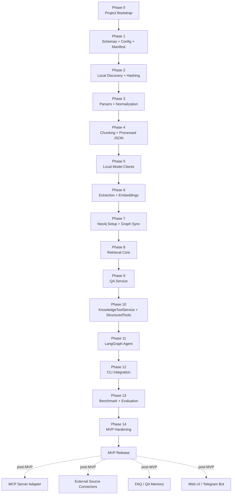

# Implementation Roadmap Index

## Purpose

This folder defines the implementation roadmap for the `personal_kb` MVP.
It sequences the build phases, dependencies, MVP scope, release gates,
post-MVP work, risk priorities, and sprint recommendations.

## When to read this

Start here for:

- roadmap updates;
- implementation planning;
- milestone sequencing;
- MVP scope and release criteria checks;
- benchmark/evaluation planning;
- risk-based prioritization;
- sprint planning.

## Source of truth

- This index is authoritative for the roadmap purpose, MVP scope, phase
  order, release criteria, post-MVP roadmap, risk priorities, sprint
  sequence, and final build-order recommendation.
- The phase files are authoritative for phase-specific purpose,
  dependencies, outputs, implementation checklist, exit criteria, and
  validation.
- Architecture, implementation contracts, and product requirements remain
  source-of-truth in their focused documentation folders.

## Reading order

1. Read this index for the current roadmap position and phase dependencies.
2. Read only the focused phase file related to the current task.
3. Follow related files listed in the focused phase document.
4. Do not scan the whole folder unless explicitly requested.

## Roadmap context

**Status:** Draft v0.1  
**Project:** `personal_kb`  
**Python:** 3.11  
**Package manager:** `uv`  
**CLI framework:** `argparse`  
**Architecture baseline:** Technical Architecture v0.3, Product Requirements
Document v0.2, Neo4j Graph Schema v0.1, Python Class Design v0.1, MCP / Tool
Contracts v0.3

**MVP execution path:**

```text
User
-> LangGraph personal_kb agent
-> LangChain StructuredTools
-> KnowledgeToolService
-> RetrievalService / QAService / GraphService / DocumentService
-> Neo4j + kb_storage + local models
```

**MVP ingestion path:**

```text
Local files in data/
-> deterministic ingestion pipeline
-> kb_storage processed JSON
-> GraphSyncService
-> Neo4j graph + vector index
```

## MVP scope summary

The MVP includes:

- Local file ingestion from `data/`.
- Supported formats: PDF, DOCX, Markdown, TXT, XLSX.
- `kb_storage/` as primary processed JSON storage.
- Neo4j graph and vector index.
- Local LM Studio LLM for extraction and answer generation.
- Local Qwen embedding model through `transformers` or
  `sentence-transformers`.
- Local Qwen reranker through `transformers` or `sentence-transformers`.
- `argparse` CLI.
- Explicit `kb setup-db` command with optional auto setup.
- No APOC dependency.
- LangGraph internal agent orchestration.
- LangChain `StructuredTool` wrappers.
- Thin tools over `KnowledgeToolService`.
- Benchmark-driven validation.

The MVP excludes:

- MCP as primary internal execution path.
- MCP server adapter implementation before core tools stabilize.
- External source ingestion from Confluence/Jira/Gmail/Google Drive.
- File move/rename/delete.
- Write actions to external systems.
- OCR for scanned PDFs.
- FAQ/QA memory.
- LLM-inferred document relationships as required pipeline behavior.
- Web UI or Telegram bot.

## Roadmap diagram



## Phase overview

| Phase | Name | Primary output | Blocks | Priority |
|---|---|---|---|---|
| 0 | [Project Bootstrap](phase-00-project-bootstrap.md) | Python package skeleton, `uv`, base config | all phases | P0 |
| 1 | [Schemas + Config + Manifest](phase-01-schemas-config-manifest.md) | Pydantic contracts and persistent manifest | ingestion, tools, graph sync | P0 |
| 2 | [Local Discovery + Hashing](phase-02-local-discovery-hashing.md) | file scanning, raw/text hash decisions | parsing, ingestion | P0 |
| 3 | [Parsers + Normalization](phase-03-parsers-normalization.md) | normalized documents for TXT/MD/PDF/DOCX/XLSX | chunking | P0 |
| 4 | [Chunking + Processed JSON](phase-04-chunking-processed-json.md) | chunked documents saved to `kb_storage` | extraction, graph sync | P0 |
| 5 | [Local Model Clients](phase-05-local-model-clients.md) | LLM, embedding, reranker wrappers | extraction, retrieval, Q&A | P0 |
| 6 | [Extraction + Embeddings](phase-06-extraction-embeddings.md) | chunk/document summary, tags, entities, vectors | graph sync, search | P0 |
| 7 | [Neo4j Setup + Graph Sync](phase-07-neo4j-setup-graph-sync.md) | constraints, vector index, upserts | retrieval | P0 |
| 8 | [Retrieval Core](phase-08-retrieval-core.md) | keyword/entity/tag/vector/graph/hybrid search | Q&A, tools | P0 |
| 9 | [QA Service](phase-09-qa-service.md) | source-grounded answers | agent tools | P0 |
| 10 | [KnowledgeToolService + StructuredTools](phase-10-knowledge-tool-service-structured-tools.md) | tool contracts callable by LangGraph | LangGraph agent | P0 |
| 11 | [LangGraph Agent](phase-11-langgraph-agent.md) | internal agent orchestration | CLI ask/search integration | P0 |
| 12 | [CLI Integration](phase-12-cli-integration.md) | `kb` commands | benchmark usage | P0 |
| 13 | [Benchmark + Evaluation](phase-13-benchmark-evaluation.md) | retrieval/Q&A metrics | release decision | P1 |
| 14 | [MVP Hardening](phase-14-mvp-hardening.md) | error handling, docs, tests | MVP release | P1 |

## Files

| Topic | File | Purpose |
|---|---|---|
| Project bootstrap | [phase-00-project-bootstrap.md](phase-00-project-bootstrap.md) | Defines the package skeleton, `uv` setup, base config, and import safety criteria. |
| Schemas, config, manifest | [phase-01-schemas-config-manifest.md](phase-01-schemas-config-manifest.md) | Defines Pydantic contracts, runtime config, manifest requirements, and processed document stores. |
| Local discovery and hashing | [phase-02-local-discovery-hashing.md](phase-02-local-discovery-hashing.md) | Defines file scanning, hash calculation, duplicate detection, and retry decisions. |
| Parsers and normalization | [phase-03-parsers-normalization.md](phase-03-parsers-normalization.md) | Defines parser modules, parser fallback strategy, and source reference preservation. |
| Chunking and processed JSON | [phase-04-chunking-processed-json.md](phase-04-chunking-processed-json.md) | Defines format-aware chunks and `kb_storage` processed JSON persistence. |
| Local model clients | [phase-05-local-model-clients.md](phase-05-local-model-clients.md) | Defines LLM, embedding, reranker, and structured extraction client boundaries. |
| Extraction and embeddings | [phase-06-extraction-embeddings.md](phase-06-extraction-embeddings.md) | Defines chunk/document extraction, normalization, aggregation, and embedding persistence. |
| Neo4j setup and graph sync | [phase-07-neo4j-setup-graph-sync.md](phase-07-neo4j-setup-graph-sync.md) | Defines schema setup, graph nodes, relationships, sync behavior, and vector index requirements. |
| Retrieval core | [phase-08-retrieval-core.md](phase-08-retrieval-core.md) | Defines retrieval layers, default pipeline, score breakdowns, fallbacks, and source refs. |
| QA service | [phase-09-qa-service.md](phase-09-qa-service.md) | Defines source-grounded answer generation, citations, warnings, and confidence behavior. |
| KnowledgeToolService and StructuredTools | [phase-10-knowledge-tool-service-structured-tools.md](phase-10-knowledge-tool-service-structured-tools.md) | Defines tool facade modules, MVP tools, adapter rules, and tool test requirements. |
| LangGraph agent | [phase-11-langgraph-agent.md](phase-11-langgraph-agent.md) | Defines agent modules, flow, routing examples, and boundaries. |
| CLI integration | [phase-12-cli-integration.md](phase-12-cli-integration.md) | Defines `kb` commands, output behavior, and service/tool reuse. |
| Benchmark and evaluation | [phase-13-benchmark-evaluation.md](phase-13-benchmark-evaluation.md) | Defines benchmark format, metrics, quality gates, and failure inspection. |
| MVP hardening | [phase-14-mvp-hardening.md](phase-14-mvp-hardening.md) | Defines stability, logging, docs, troubleshooting, and regression coverage. |

## MVP release criteria

The MVP can be considered complete when:

1. `kb setup-db` initializes Neo4j schema.
2. `kb ingest data` processes TXT, MD, PDF, DOCX, and XLSX files.
3. Processed documents are saved in `kb_storage`.
4. Neo4j graph contains documents, chunks, tags, entities, document types,
   versions, and duplicates.
5. Chunk embeddings are stored in JSON and Neo4j.
6. `kb search` returns ranked document results with confidence and score
   breakdown.
7. `kb ask` returns source-grounded answers with source references.
8. LangGraph agent uses LangChain StructuredTools internally.
9. Agent does not have access to ingestion, graph rebuild, or destructive file
   operations.
10. Benchmark results can be generated for 15-20 test cases.

## Post-MVP roadmap

| Future item | Description | Dependency |
|---|---|---|
| MCP server adapter | Expose same core tools to external MCP clients. | Stable KnowledgeToolService |
| External MCP source clients | Consume Confluence/Jira/Gmail/Drive through MCP clients. | Stable RawDocument contract |
| FAQ/QA memory | Store frequent questions and supported answers. | Stable Q&A and versioning |
| LLM-inferred relationships | Add SUPPORTS/CONTRADICTS/UPDATES/EXPLAINS. | Stable deterministic graph |
| Web UI | Search, Q&A, document cards, graph navigation. | Stable APIs/tools |
| Telegram bot | Chat-style interface over same tools. | Stable agent/tool layer |
| OCR | Scanned PDF support. | Stable parser abstraction |
| Access control | Permissions and visibility filtering. | Multi-source support |

## Risk-based priorities

| Risk | Highest-risk phase | Mitigation |
|---|---|---|
| Model output invalid JSON | Phase 6 | Pydantic validation + retries + failed status |
| Poor retrieval quality | Phase 8/13 | Benchmark early, tune SearchPlan and scoring |
| Graph schema drift | Phase 7 | Keep JSON as source of truth, idempotent sync |
| Slow local models | Phase 6/9 | Cache processed JSON, avoid reprocessing unchanged docs |
| Tool business logic leakage | Phase 10/11 | Tools are adapters only, test KnowledgeToolService separately |
| Duplicate/version confusion | Phase 2/7 | Clear manifest rules and graph relationships |
| Overbuilding MCP too early | Post-MVP | Build LangGraph/StructuredTools first |

## Recommended first sprint

The first sprint should not touch LangGraph, MCP, or Q&A generation.

### Sprint 1 target

```text
schemas + config + manifest + TXT/MD parsing + processed JSON persistence
```

### Sprint 1 deliverables

1. Project skeleton.
2. Config loader.
3. Pydantic schemas.
4. Manifest store.
5. Processed document store.
6. File discovery.
7. Raw bytes hashing.
8. TXT parser.
9. Markdown parser.
10. Fixed-size and heading-aware chunking.
11. `kb status`.
12. Basic `kb ingest data` that saves JSON without models or Neo4j.

### Sprint 1 acceptance criteria

- User can put TXT/MD files into `data/`.
- `kb ingest data` creates `kb_storage/manifest.json` and per-document JSON.
- Re-running `kb ingest data` skips unchanged documents.
- Failed files are represented in manifest.

## Recommended second sprint

### Sprint 2 target

```text
model clients + extraction + embeddings + Neo4j setup/sync
```

### Sprint 2 deliverables

1. LM Studio client.
2. Embedding client.
3. Reranker client skeleton.
4. Chunk extraction service.
5. Document aggregation service.
6. `kb setup-db`.
7. Neo4j constraints/indexes/vector index.
8. Graph sync from JSON.
9. TXT/MD end-to-end ingestion into Neo4j.

### Sprint 2 acceptance criteria

- TXT/MD documents have summaries, tags, entities, embeddings.
- Neo4j contains `Document`, `Chunk`, `Tag`, `Entity`, `DocumentType` nodes.
- Graph sync is idempotent.

## Recommended third sprint

### Sprint 3 target

```text
retrieval + tools + LangGraph agent + CLI search/ask
```

### Sprint 3 deliverables

1. Keyword search.
2. Entity/tag search.
3. Vector search.
4. Graph expansion.
5. Hybrid scoring.
6. Reranker integration.
7. RetrievalService.
8. QAService.
9. KnowledgeToolService.
10. LangChain StructuredTools.
11. LangGraph agent.
12. `kb search` and `kb ask`.

### Sprint 3 acceptance criteria

- User can ask document lookup questions.
- User can ask source-grounded Q&A.
- Results include confidence, score breakdown, matched chunks, and source
  references.

## Recommended fourth sprint

### Sprint 4 target

```text
PDF/DOCX/XLSX support + benchmark + hardening
```

### Sprint 4 deliverables

1. PDF parser with `pdfplumber` and PyMuPDF fallback.
2. DOCX parser with `mammoth` and `python-docx` fallback.
3. XLSX parser with `openpyxl`.
4. Benchmark runner.
5. Evaluation metrics.
6. Error handling and logs.
7. MVP documentation.

### Sprint 4 acceptance criteria

- System processes all MVP file formats.
- Benchmark with 15-20 cases runs end-to-end.
- MVP release criteria are satisfied.

## Final recommendation

Build in this order:

```text
schemas/config/manifest
-> local parsing/chunking
-> processed JSON
-> local models/extraction/embeddings
-> Neo4j setup/sync
-> retrieval
-> Q&A
-> tools
-> LangGraph agent
-> CLI
-> benchmark/hardening
```

Do not start with LangGraph or MCP. They depend on stable service contracts.
The first technical checkpoint is a working `kb_storage` loop with
deterministic ingestion and skip/retry behavior.

## Update rules

- Update this index when phase order, MVP scope, release criteria, post-MVP
  items, risk priorities, or sprint sequencing changes.
- Update the focused phase file when phase-specific outputs, checklist items,
  exit criteria, or validation rules change.
- Update related architecture, implementation, or product requirement files
  when the roadmap changes behavior owned by those documents.

## Do not read everything by default

Coding agents should open only this index and the focused phase file needed
for the current task.
